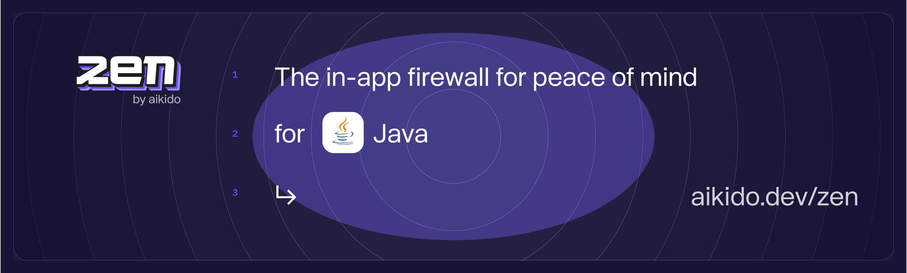

# Zen, in-app firewall for Java | by Aikido
[](https://app.codecov.io/gh/aikidosec/firewall-java)
[](http://makeapullrequest.com)
[](https://github.com/AikidoSec/firewall-java/actions/workflows/gradle-tests.yml)
[](https://github.com/AikidoSec/firewall-java/actions/workflows/end2end.yml)

Zen, your in-app firewall for peace of mind– at runtime.

Zen is an embedded Web Application Firewall that autonomously protects your Java apps against common and critical attacks.

Zen protects your Java apps by preventing user input containing dangerous strings, which allow SQL injections. It runs on the same server as your Java app for easy installation and zero maintenance.

Zen for Java currently supports onwards of Java 17. The latest tested version is Java 21. We offer support for Java, Kotlin and Groovy.

## Features

Zen will autonomously protect your Java applications from the inside against:

* 🛡️ [NoSQL injection attacks](https://www.aikido.dev/blog/web-application-security-vulnerabilities)
* 🛡️ [SQL injection attacks](https://www.aikido.dev/blog/the-state-of-sql-injections)
* 🛡️ [Command injection attacks](https://www.aikido.dev/blog/command-injection-in-2024-unpacked)
* 🛡️ [Path traversal attacks](https://owasp.org/www-community/attacks/Path_Traversal) *This support is currently limited to Path/Paths and new File(String)*
* 🛡️ [Server-side request forgery (SSRF)](./docs/ssrf.md)
* 🛡️ [Attack wave detection](https://help.aikido.dev/zen-firewall/zen-features/attack-wave-protection)

Zen operates autonomously on the same server as your Java app to:

* ✅ Secure your app like a classic web application firewall (WAF), but with none of the infrastructure or cost.
* ✅ Rate limit specific API endpoints by IP or by user
* ✅ Allow you to block specific users manually
* ✅ Auto-generate API specifications
## Supported libraries and frameworks
### Web frameworks
#### Java
* ✅ [`Spring MVC`](docs/spring.md) 3.x
* ✅ [`Javalin`](docs/javalin.md) 6.x
* 🚧 [`Spring Webflux`](docs/spring_webflux.md) 3.x

#### Kotlin
* ✅ [`Spring MVC`](docs/spring.md) 3.x
* ✅ [`Javalin`](docs/javalin.md) 6.x
* 🚧 [`Spring Webflux`](docs/spring_webflux.md) 3.x
* 🚧 `Ktor`

#### Groovy
* ✅ [`Spring MVC`](docs/spring.md) 3.x
* 🚧 [`Spring Webflux`](docs/spring_webflux.md) 3.x

#### 🚧 Scala
* 🚧 `Akka`

### Database drivers
* ✅ [`MariaDB Java Client`](https://mvnrepository.com/artifact/org.mariadb.jdbc/mariadb-java-client)
* ✅ [`Microsoft JDBC Driver For SQL Server`](https://mvnrepository.com/artifact/com.microsoft.sqlserver/mssql-jdbc)
* ✅ [`MySQL Connector/J`](https://mvnrepository.com/artifact/com.mysql/mysql-connector-j)
* ✅ [`PostgreSQL JDBC Driver`](https://mvnrepository.com/artifact/org.postgresql/postgresql)
* ✅ [`HyperSQL JDBC Driver`](https://mvnrepository.com/artifact/org.hsqldb/hsqldb)
* ✅ `SQLite JDBC Drivers`

### API Tools
* ✅ [`OkHttp`](https://mvnrepository.com/artifact/com.squareup.okhttp3/okhttp) (*no SSRF redirect coverage*)
* ✅ [`Apache HttpClient`](https://mvnrepository.com/artifact/org.apache.httpcomponents/httpclient) (*no SSRF redirect coverage*)

## Installation
You can install Zen by downloading the zip file [here](https://github.com/AikidoSec/firewall-java/releases/latest) and unzipping it to your directory of choice,
we picked `/opt/zen` here for our Linux system as an example. We also have support for Windows and Mac OS X.
Please ensure you do not alter the structure of this folder and that the process can read & write to it.

To activate Zen you then just have to add the following `-javaagent` to your Java command **before** the `-jar` argument
```
java -javaagent:/opt/zen/agent.jar -jar build/myapp.jar
```
Replace `/opt/zen` with your directory of choice.

To use user-blocking and/or rate-limiting features, you will have to include the following Jarfile into your repository
### Gradle
Add the following code to your `build.gradle` file.
```gradle
dependencies {
    # ...
    implementation files('/opt/zen/agent_api.jar')
    # ...
}
```
### Maven
Add the following code to your `pom.xml` file.
```xml
<dependency>
    <groupId>dev.aikido</groupId>
    <artifactId>agent_api</artifactId>
    <version>1.0</version>
    <systemPath>/opt/zen/agent_api.jar</systemPath>
</dependency>
```


For further setup continue to your Web Framework of choice ([Click here for Spring](./docs/spring.md))

## Reporting to your Aikido Security dashboard

> Aikido is your no nonsense application security platform. One central system that scans your source code & cloud, shows you what vulnerabilities matter, and how to fix them - fast. So you can get back to building.

Zen is a new product by Aikido. Built for developers to level up their security. While Aikido scans, get Zen for always-on protection.

You can use some of Zen’s features without Aikido, of course. Peace of mind is just a few lines of code away.

But you will get the most value by reporting your data to Aikido.

You will need an Aikido account and a token to report events to Aikido. If you don't have an account, you can [sign up for free](https://app.aikido.dev/login).

Here's how:
* [Log in to your Aikido account](https://app.aikido.dev/login).
* Go to [Zen](https://app.aikido.dev/runtime/services).
* Go to apps.
* Click on **Add app**.
* Choose a name for your app.
* Click **Generate token**.
* Copy the token.
* Set the token as the environment variable `AIKIDO_TOKEN`


## Running in production (blocking) mode

By default, Zen will only detect and report attacks to Aikido.

To block requests, set the `AIKIDO_BLOCK` environment variable to `true`.

See [Reporting to Aikido](#reporting-to-your-aikido-security-dashboard) to learn how to send events to Aikido.

## Additional configuration

[Configure Zen using environment variables for authentication, mode settings, debugging, and more.](https://help.aikido.dev/doc/configuration-via-env-vars/docrSItUkeR9)

## License

This program is offered under a commercial and under the AGPL license.
You can be released from the requirements of the AGPL license by purchasing
a commercial license. Buying such a license is mandatory as soon as you
develop commercial activities involving the Zen software without
disclosing the source code of your own applications.

For more information, please contact Aikido Security at this
address: support@aikido.dev or create an account at https://app.aikido.dev.


## Code of Conduct

See [CODE_OF_CONDUCT.md](.github/CODE_OF_CONDUCT.md) for more information.

## Security

Our bug bounty program is public and can be found by all registered Intigriti users at: https://app.intigriti.com/researcher/programs/aikido/aikidoruntime

See [SECURITY.md](.github/SECURITY.md) for more information.
